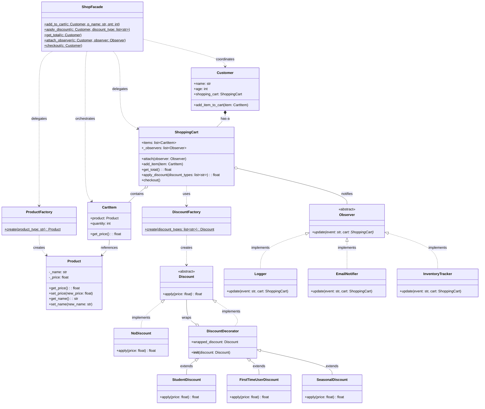

# 🛒 E-Commerce Shopping Cart — Design Patterns Assignment

A shopping cart system built in Python, developed across 3 phases as part of a university design patterns course. The project intentionally starts with poorly structured code (Phase 0) and evolves through creational, structural, and behavioral patterns — each phase fixing real design problems identified in the previous one.

---

## What It Does

- Add products to a customer's shopping cart
- Stack multiple discount types on top of each other
- React to cart events (item added, discount applied, checkout) via observers
- Hide subsystem complexity behind a single Facade interface

---

## Patterns Used

### Creational
| Pattern | Where | Why |
|---|---|---|
| **Factory Method** | `DiscountFactory`, `ProductFactory` | Centralizes object creation. Callers never instantiate products or discounts directly — they request them by type string. Adding a new type requires no changes to calling code. |

### Structural
| Pattern | Where | Why |
|---|---|---|
| **Decorator** | `DiscountDecorator`, `StudentDiscount`, `FirstTimeUserDiscount`, `SeasonalDiscount` | Allows stacking multiple discounts without modifying existing classes. Each decorator wraps another `Discount` and delegates inward before applying its own rate. |
| **Facade** | `ShopFacade` | Hides the coordination of `ProductFactory`, `CartItem`, `Customer`, and `ShoppingCart` behind a single entry point. Callers never interact with subsystem classes directly. |

### Behavioral
| Pattern | Where | Why |
|---|---|---|
| **Strategy** | `Discount` (ABC), all discount subclasses | Each discount type encapsulates its own calculation algorithm. `Discount` is a formal abstract base class — Python enforces that every concrete discount implements `apply()`. |
| **Observer** | `Observer` (ABC), `Logger`, `EmailNotifier`, `InventoryTracker` | `ShoppingCart` notifies all attached observers on cart events. New reactions (logging, email, inventory) are added as new classes — `ShoppingCart` is never modified. |

---

## Architecture Diagram



---

## How It Works

A customer's cart is managed entirely through `ShopFacade`. When `add_to_cart` is called, the Facade creates a `Product` via `ProductFactory`, wraps it in a `CartItem`, and adds it to the customer's `ShoppingCart`. The cart then fires an `"item_added"` event to all attached observers.

When `apply_discount` is called with a list of discount type strings, `DiscountFactory` builds a chain of Decorator objects — each wrapping the previous one — and calls `apply()` on the outermost, which delegates inward. The result is the final discounted price. A `"discount_applied"` event is fired after.

When `checkout` is called, a `"checkout"` event fires — `EmailNotifier` reacts to this and sends a confirmation.

---

## How to Run

No dependencies outside the Python standard library.

```bash
# Clone the repo
git clone <your-repo-url>
cd <repo-folder>

# Run 
python main.py
```

Expected output:
```
[LOG] item_added
[INVENTORY] macbook — 3 unit(s) reserved
[LOG] item_added
[INVENTORY] iphone — 1 unit(s) reserved
[LOG] discount_applied
[EMAIL] Sending order confirmation — total: $4499.97
```

---

## Project Structure

```
├── README.md                  
├── PATTERNS.md               ← Documenting patterns per phase
├── PROBLEMS.md               ← initial code analysis (Faz 0)
├── main.py                       ← source code
├── docs/
│   ├── diagrams/              ← UML diagrams
│   └── ai-log/
│       ├── phase1.md
│       ├── phase2.md
│       └── phase3.md
└── .github/workflows/ci.yml 
```
