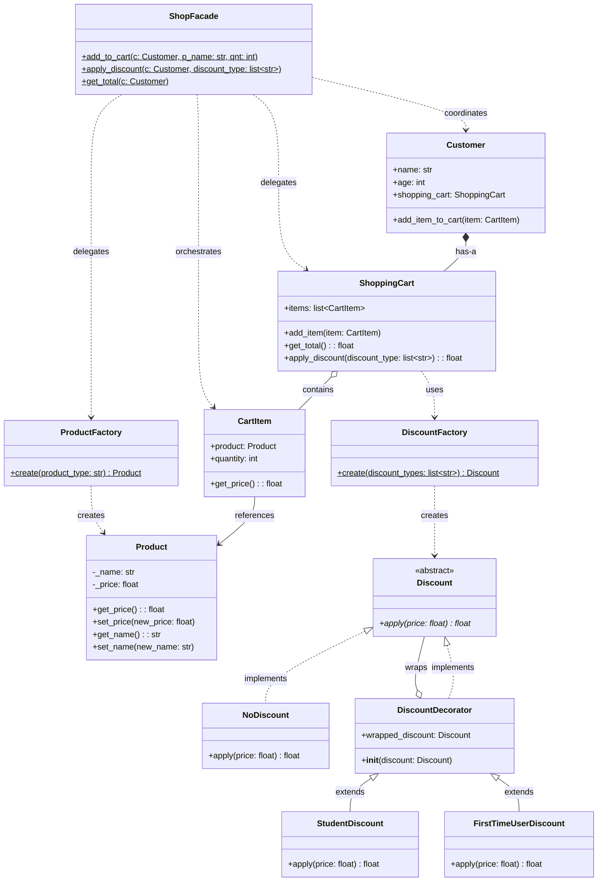

# PHASE 2: 

```mermaid
classDiagram
    class Customer {
        +name: str
        +age: int
        +shopping_cart: ShoppingCart
        +add_item_to_cart(item: CartItem)
    }
    
    class ShoppingCart {
        +items: list~CartItem~
        +add_item(item: CartItem)
        +get_total(): float
        +apply_discount(discount_type: list~str~): float
    }
    
    class CartItem {
        +product: Product
        +quantity: int
        +get_price(): float
    }
    
    class Product {
        -_name: str
        -_price: float
        +get_price(): float
        +set_price(new_price: float)
        +get_name(): str
        +set_name(new_name: str)
    }

    class Discount {
        <<abstract>>
        +apply(price: float)* float
    }
    
    class NoDiscount {
        +apply(price: float) float
    }

    class DiscountDecorator {
        +wrapped_discount: Discount
        +__init__(discount: Discount)
    }
    
    class StudentDiscount {
        +apply(price: float) float
    }
    
    class FirstTimeUserDiscount {
        +apply(price: float) float
    }
    
    class DiscountFactory {
        +create(discount_types: list~str~)$ Discount
    }
    
    class ProductFactory {
        +create(product_type: str)$ Product
    }

    class ShopFacade {
        +add_to_cart(c: Customer, p_name: str, qnt: int)$
        +apply_discount(c: Customer, discount_type: list~str~)$
        +get_total(c: Customer)$
    }

    %% Core Relationships
    Customer *-- ShoppingCart : has-a
    ShoppingCart o-- CartItem : contains
    CartItem --> Product : references
    
    %% Decorator Pattern Relationships (Structural)
    Discount <|.. NoDiscount : implements
    Discount <|.. DiscountDecorator : implements
    DiscountDecorator o-- Discount : wraps
    DiscountDecorator <|-- StudentDiscount : extends
    DiscountDecorator <|-- FirstTimeUserDiscount : extends
    
    %% Factory Relationships (Creational)
    DiscountFactory ..> Discount : creates
    ProductFactory ..> Product : creates
    ShoppingCart ..> DiscountFactory : uses
    
    %% Facade Relationships (Structural)
    ShopFacade ..> Customer : coordinates
    ShopFacade ..> ProductFactory : delegates
    ShopFacade ..> CartItem : orchestrates
    ShopFacade ..> ShoppingCart : delegates
```